**MASTERING NODE.JS CRASh COURSE**

**Requirement / Prerequisites**  
1.JavaScript fundamentals (functions, loops, objects, classes etc)  
2. Asynchronous programming - Promise, callbacks, async/await.   
3. HTTP Basics  (Methods, status codes, etc)   
4. How JSON APIs work.   

**Setting Development Environment**  
**Browser**  
There are many browsers out there but most developers prefer to use Google Chrome or FireFox. I usually use Google chrome for development and I recommend it too. Download https://www.google.com/chrome/ Google Chrome if you do not have one.

The browser render your HTML code to a human read website.

**Back-end development:**  Deals with the server, database, and application logic that powers the website or application. Back-end development (the server, database, and application logic), often requiring a blend of creative problem-solving and technical skills to deliver smooth and efficient user experiences.  
The backend interacts with frontend and the database using a backend programming language that could be (Node.js, Python, Ruby, PHP, etc). Look at the following figure to understand the interaction between client. A client send a HTTP request to the backend and the backend return a HTTP response to the client computer(The response could be an HTML page, txt, image, or any other form of data). HTTP(Hypertext Transfer Protocol) is a communication protocol that allow transmitting data between a client and a sever. It is designed for communication between web browsers(client) and web servers.   

**Code Editor**  

As web developer, you should write code using a text or code editor. Therefore, to write HTML code, CSS, JS, React etc. You need to have a code editor.

I will use Visual studio code and I will use it in this challenge too. I strongly suggest to use Visual Studio Code because it has lots of productivity extensions that makes super productive. Now, let's download https://code.visualstudio.com/Download visual studio code.  

------------------------------------------------------------------------------------------------------------------------------------------------------------------------------
**EVERY LESSONS YOU WILL FIND ON THIS "NODE.JS" COURSE ** (Below)  
------------------------------------------------------------------------------------------------------------------------------------------------------------------------------

➡️ **Course Outline**:  
1.What is Node.js  and how does it work ?  
2. Installation, setup, package.json, npm etc.  
3.Modules import/export (CommonJS & ES Modules).  
4.HTTP Module, reg/res, routing, serving JSON/HTML.  
5.Custom middleware.  
6.Other Core Modules - fs, path, url, events, process, os.’  
7. Some good Resource Documentations To Help As You Go:  
https://nodejs.org/en/learn/  ,  https://www.w3schools.com/nodejs  

➡️ **What is Node.js ?**   
a)“Node.js” is an open-source “Javascript runtime”.  
b)“Node.js” Uses the “v8 Javascript engine” that Google chrome uses. Built on C++.  
c)“Node.js” is basically used for deveoping “server-side and networking apps/apis”.  
d)“Node.js” takes Javascript out of the browser .  
e)“Node.js” is fast, scalable and popular in many areas of the industry.  
f)“Node.js” is used by companies like “Netflix, Uber, Linkedin, startups”  

➡️ **HOW NODE.JS  WORKS - LESSON 1**   

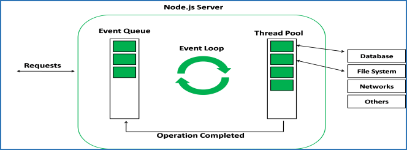

a)V8 JS Engine: Node.js, is built under the “v8 JS Engine” same engine that powers google chrome & it is written in C++.  

b)Non-Blocking: Node.js is what we call “non-blocking”, which means that , it doesnot wait around for I/o operations.  

c)Single Threaded: Refers to javascript execution model, specifically the event loop.  
Node.js  executes your javascript code within a “single main thread”. This means that, at any given point , only one piece of your javascript code, is likely running.  

d)Event Loop: Node.js uses an event loop , which is a mechanism that allows Node, “to perform non-blocking I/o operations”.  

➡️ **WHAT IS NODE.js USED FOR - LESSON 2**  
✔️ Node.js Is Used For The Following:  
1)APIs:  (like Restful apis, GraphQl apis).  

2)Server-rendered apps:  

3)Real-time applications: like chat, realtime game etc.  

4)Microservices: A small independent services that works together.  

5)Command Line Tools: You could build CLI command line interfaces.  

6)Bots:  (Like building a twitter bot, discord bots).  

7)Web Scraping: Nodejs is good for “web scraping”.  

8)Web Server:   Nodejs provides robust capibilities for building web servers , leveraging its asyncronous, event -driven architecture.   

✔️ NPM (node package manager): Helps us as well to install 3rd party packages.  

✔️ Repple :- (read, val, print, loop): A “command line” environment to run javascript. You can start that “command promt” by just typing node. It just a nice way to test out code and just experiment the javascript and not have to do it through the file, or browser or anything like that.  
E.g Below on a diagram  
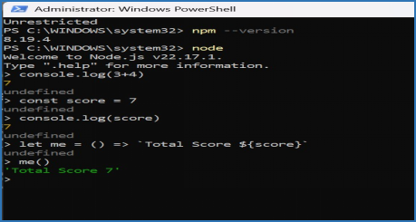

✔️ When Creating A NodeJs Project:   
	**NOTE:** When starting a new “nodejs project”.  

The first 1st thing You will need to create 	a  “package.json” file .   
And we 	can do that by using an “NPM command on VSCode terminal (instead of creating it manuel)”, bellow is the following step :  
 npm init  
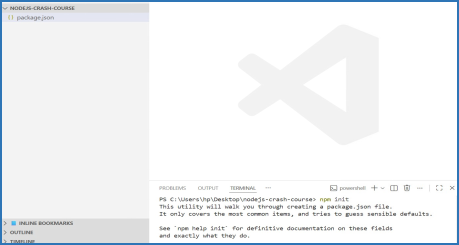

➡️ **MODULES IMPORT/EXPORT (commonJS & ES MODULES) - LESSON 3**  
 ✔️ CommonJS:  Uses synchronous, dynamic loading with require / module.exports “CommonJS” is the traditional/native Nodejs module system that is widely used, especilly in older projects  and libraries. It file extension it uses are .js or .cjs  

E.g Below is an example for CommonJS module usage  

Utils.js file  
function randomNumberGenerator() {  
    return Math.floor(Math.random() * 200) + 5;  
}  

function celsiusToFahrenheit(celsius) {  
    let f = celsius * 1.8;  
    let total = f + 32;  

    return total;  
    // return (celsius * 1.8) + 32;  
}  

 
/**  
 * "EXPORTING"  MULTIPLY STUFFS
 */  
module.exports =  
{  
    randomNumberGenerator,  
    celsiusToFahrenheit  
};  

index.js file   
const {randomNumberGenerator, celsiusToFahrenheit} = require('./utils.js'); 

/**  
 * CONSOLE.LOGS 
 */  
console.log(`RandomNumberGenerator: ${randomNumberGenerator()}`);  

console.log(`Celsius To Fahrenheit: ${celsiusToFahrenheit(20)}`);  

✔️ ES Modules: Uses asynchronous, static loading with import / export syntax. “ES Module” are the modern, standard format, offering better performance and environment compatibility across Node.js and browsers.  They support features like tree-shaking.   
It file extension it uses is .mjs  

**NOTE:** To Use ESM in Node.js,  you can either:  
✔️ Use the .mjs file extension for your module files.  
✔️ Add “type”:  “module” to your package,json file, which makes all .js files in that project treated as ESM.  

E.g Below is an example for ES module usage  
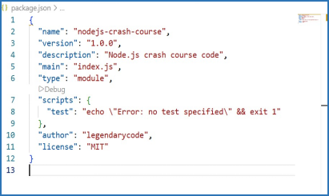

➡️ **HTTP MODULE, REG/RES, ROUTING, SERVING JSON/HTML - LESSON 4**
 
✔️ Http Module , Creating A Server , Working With Request / Response:

**NOTE:**  import http from “http”;  or  import { createServer } from ‘http’;  
1. This is used in Node.js project to import  built-in HTTP module.  
2. This module provides the core functionality for creating HTTP servers and making HTTP requests within your Node.js application.  
3. You can use the “http module” for creating a http server.  
4. You can also use the “http module” for  making http request (in order to fetch data from an API etc.)  
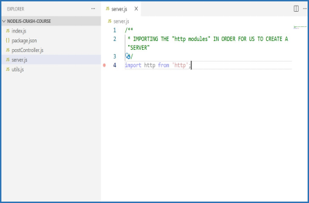   
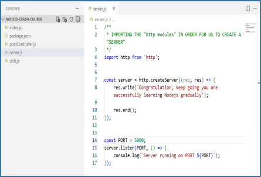

✔️ Some command line terminal :  
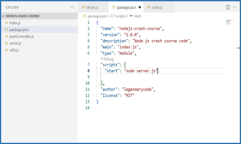  
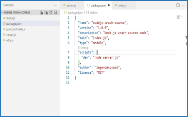   

i. “npm”: NPM stands for Node Package Manager. It is the default package manager for Node.js. It serves several key purposes within the Node.js ecosystem. 
NPM simplifies the process of building and maintaining Node.js applications by providing a robust system for managing external code, handling dependencies, and facilitateing code sharing within the developer community.    
https://www.npmjs.com/    

ii.“npm run dev” terminal command:- It is used in node.js projects, to initiate a development environment.  
The primary purpose of npm  run dev is to provide a streamlined and efficient workflow during active code development.
npm run dev automates the process of running and observing changes in Node.js project or application during development , saving developers from manually restarting servers or refreshing their browser after every code modification.   

iii.“npm start” terminal command: It used in node.js project, to execute a predefined script named “start” within the project’s package.json file.   

iv.“npm install nodemon” terminal command: Is used to install the nodemon package as a devlopment utility in a Node.js project.
nodemon is a tool that monitors for changes in your source code files and automatically restarts your Node.js application when those changes are detected.
This is particularly useful during development because it eliminates the need to manually stop and restart your server everytime you make an iteration to your code.   

v.“npm install -D nodemon”: Here is the breakdown of this commands:   
npm install :- This is the command to install packages using Node Package Manager(npm).   

-D  (or --save-dev ) :-This simply specifies that, nodemon should be installed as a development dependency. This means it’s a package required only during the “development phase of your project”  (e.g for testing, building, or running development servers) and not for the “final production deployment”.  

nodemon :- This is the package itself.It is used to setup automatic server restarts during Node.js development, making the development workflow more efficient.  

**NOTE:**  “development dependency” (or devDependency ) refers to a package or library 	that is only needed during the “development phase of a project” and is “not required for 	the application to run in a production environment”.These dependencies typically 	include tools that aid in development, testing , and building, but are not part of the core 	functionality of the deployed application.    

	**NOTE:**  When someone gets your code from “github”, all they have to do , is to just 	type:  npm install (or npm i ), and it will automatically instal the npm packages needed 	for the application or project. E.g like your nodemon npm folder file.   

✔️ .gitignore file, allows developers to specify which files and directories should be excluded from version control (Git). This helps keep repositories tidy, preventing sensitive information from being exposed , and ensures that only essential files are tracked.  A diagram below:  
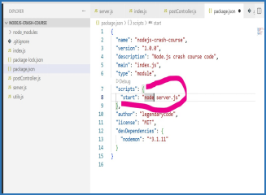  

**NOTE:**  Since we are trying to automatically running the server, (without reloading it 	manually ourself ), we will have to remove the circle red diagram writeupand change it 	to the yollow diagram writeup,  diagrams below, after that we can now use the command npm start .  

**NOTE:**  Since we are trying to automatically running the server, (without reloading it 	manually ourself ), we will have to remove the circle red diagram writeupand change it 	to the yollow diagram writeup,  diagrams below, after that we can now use the command npm start .  
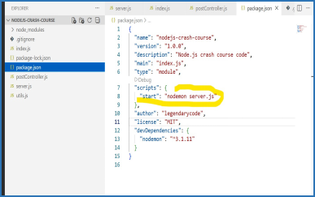  

✔️ .env File :- The primary reason for using a .env file in a Node.js project is to manage environment variables. Which offers significant advantages for security and flexibility.   
E.g diagram below:  
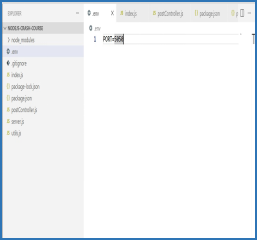    
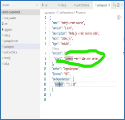    
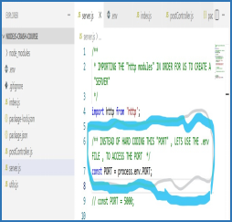    

✔️ Why we use .env file in Node.js  includes:  
i). Security: We use .env file , to keep sensitive information, such as API keys, database passwords, and secret keys , out of your source code.
By doing this, you prevent accidental exposure of credentials when pushing your code to your version control systems like Git.  
ii). Configuration Management: Environment variables allows you to change the behaviour of your application based on the enviroment in which it’s running (e.g ., development, testing, staging, or production) without changing the underlying codebase.  
iii). Portability:  It makes the application more portable. Different environments can be have different configurations stored in their respective .env  files, which are loaded when the application starts.  

**NOTE :**  The difference between “npm start” and “node start.js (or node index.js)”, is 	that :  
1. npm  start  is a convenience command that relies on your package.json configuration to 	execute a specific script, offering flexibility for defining complex startup procedures and environment settings.  
2. node start.js (or node index.js) (or node app.js): Is a direct execution command that runs a specific javascript file with the Node.js runtime , without involving  package.json scripts.  

✔️ PostMan VsCode Extension : We can make a “Http Request” using postman in VSc.   
**NOTE :**  The PostMan VsCode Extension: Streamline API development and testing with the power of Postman. You can install it on VSCode. 
With “Postman Vs Code” extension, you can develop and test your APIs right from the VSCode. (Make sure to install the extension first).   
PostMan is used to build, test & manage APIs. It allows developers to design, test, and document APIs without writing code, send API requests to check 		     functionalityand retrieve  data, and automate testing  through collections and scripts.   
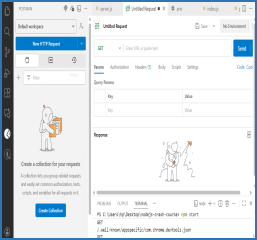  
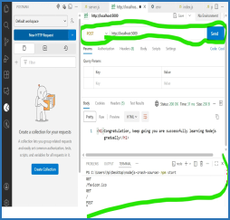  

✔️ Creating A Server That Will Check For “get Request” :- These diagramatic image , indicates and shows you if the Request is not “GET Request” , it will show Serverside Error (500).  Tested it with “PostMan VSC extension ()” which PostMan is used to build, test & manage APIs.   
E.g below   

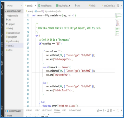  
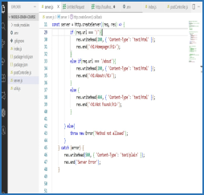  

/**
     * CREATING A SERVER THAT WILL CHECK FOR "get Request", WITH try catch
 */  
try {  
	// Check if it is a "Get request"  
	if(req.method === 'GET'){  
		
		if (req.url === '/'){  
			res.writeHead(200, { 'Content-Type': 'text/html' });  
			res.end('<h1>Homepage</h1>');  
		}     
		else if(req.url === '/about'){  
			res.writeHead(200, { 'Content-Type': 'text/html' });  
			res.end('<h1>About</h1>');  
		}  
		else {  
			res.writeHead(404, { 'Content-Type': 'text/html' });  
			res.end('<h1>Not Found</h1>');  
		}  

	} else{  
		throw new Error('Method not allowed');  
	}  
} catch (error) {  
	res.writeHead(500, { 'Content-Type': 'text/plain' });  
	res.end('Server Error');  
}  

✔️  Loading Files, Using The FS (File System Module)” :- fs, is th name of the built-in Node.js  module that provides functionalities for interacting with the file system. 
 Here I will be using it to load an html file.  
1. So we start by creating a folder on VSCode project file e.g called “public”.  
2. Also, we will then create 2 files inside the folder , e.g called “index.html” & “about.html”.  
3. Also , make sure to import the fs file system e.g on the “server.js file”.  

E.g Diagramatic examples below  
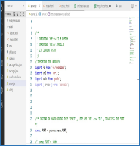  
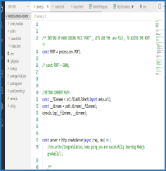  
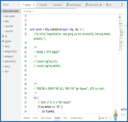  
  

/**    
 * IMPORTING THE fs FILE SYSTEM
 * IMPORTING THE url MODULE
 * GET CURRENT PATH
 */   
//IMPORTING THE MODULES  
import fs from 'fs/promises';  
import url from 'url';  
import path from 'path';  
import { error } from 'console';  

//GETING CURRENT PATH  
const __filename = url.fileURLToPath(import.meta.url);  
const __dirname = path.dirname(__filename);  
console.log(__filename, __dirname);  

const server = http.createServer(async (req, res) => {  
    //res.write('Congratulation, keep going you are successfully learning Nodejs gradually');  

    /**  
     * MAKING A "HTTP REQUEST"  
     */  
    // console.log(req.url);  
    // console.log(req.method);  

    /**  
     * CREATING A SERVER THAT WILL CHECK FOR "get Request", WITH try catch
     */  
    try {    
        // Check if it is a "Get request"  
        if(req.method === 'GET'){  
            let filePath;  
            if (req.url === '/'){  
                // res.writeHead(200, { 'Content-Type': 'text/html' });  
                // res.end('<h1>Homepage</h1>');  
                filePath = path.join(__dirname, 'public', 'index.html');  
            }    
            else if(req.url === '/about'){  
                // res.writeHead(200, { 'Content-Type': 'text/html' });  
                // res.end('<h1>About</h1>');   
                filePath = path.join(__dirname, 'public', 'about.html');  
            }   
            else {  
                // res.writeHead(404, { 'Content-Type': 'text/html' });  
                // res.end('<h1>Not Found</h1>');  
                throw new Error('Not Found');  
            }  
            const data = await fs.readFile(filePath);  
            res.setHeader('Content-Type', 'text/html');  
            res.write(data);  
            res.end();  

        } else{  
            throw new Error('Method not allowed');  
        }  
    } catch (error) {  
        res.writeHead(500, { 'Content-Type': 'text/plain' });  
        res.end('Server Error');  
    }  

✔️ Lets Say We Want To Check For The “url” & “method” (RestAPI) :-     
	E.g Diagramatic examples below   
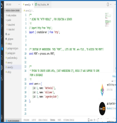  
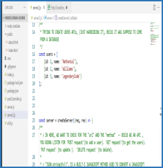  
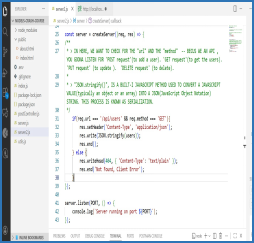  
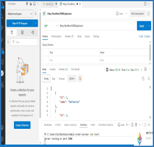  

/**  
 * USING THE "HTTP MODULE" , FOR CREATING A SERVER
 */  
// import http from 'http';  
import { createServer } from 'http';  

/** INSTEAD OF HARDCODING  THIS "PORT", , LETS USE THE .env FILE , TO ACCESS THE PORT*/  
const PORT = process.env.PORT;  

/**  
 * TRYING TO CREATE USERS APIs, (JUST HARDCODING IT), BECUS IT WAS SUPPOSE TO COME FROM A DATABASE  
 */  
const users = [
    {id: 1, name: 'Nathaniel'},
    {id: 2, name: 'Williams'},
    {id: 3, name: 'LegendaryCode'}
];  

const server = createServer((req, res) => {  
/**  
* > IN HERE, WE WANT TO CHECK FOR THE "url" AND THE "method"  -- BECUS WE CREATINGAN API , YOU GOONA LISTEN FOR 'POST request'(to add a user). 'GET request'(to get the users). 'PUT request' (to update ).  'DELETE request' (to delete).  
*  
* > "JSON.stringify()", IS A BUILT-I JAVASCRIPT METHOD USED TO CONVERT A JAVASCRIPT VALUE(typically an object or an array) INTO A JSON(JavaScript Object Notation) STRING. THIS PROCESS IS KNOWN AS SERIALIZATION.  
*/
if(req.url === '/api/users' && req.method === 'GET'){  
	res.setHeader('Content-Type', 'application/json');  
	res.write(JSON.stringify(users));  
	res.end();   
}   
		else if(req.url.match(/\/api\/users\/([0-9]+)/) && req.method === 'GET')  
{
				// res.setHeader('Content-Type', 'application/json');  
				// res.write(JSON.stringify({ id: 1, name: 'John Doe' }));  
				// res.end();  

			const id = req.url.split('/')[3];  
				const user = users.find((user) => user.id === parseInt(id));  
				if(user){  
					res.setHeader('Content-Type', 'application/json');  
					res.write(JSON.stringify(user));  
					res.end();  
				}  
				else{  
					res.setHeader('Content-Type', 'application/json');  
					res.statusCode = 404;  
					res.write(JSON.stringify({ message: 'User not found' }));  
					res.end();  
				}  
		   }  

else {  
	// res.writeHead(404, { 'Content-Type': 'text/plain' });  
	// res.end('Not Found, Client Error');  
res.setHeader('Content-Type', 'application/json');  
	res.statusCode = 404;  
	res.write(JSON.stringify({ message: 'Route not found' }));  
	res.end();  
}  
});  

server.listen(PORT, () => {  
console.log(`Server running on port ${PORT}`);
});

**NOTE :**  In Node.js , req.url.match(/\/api\/users\/([0-9]+)/) , is a javascript 	expression used in an HTTP server’s request handler to check if an incoming 	request URL matches a specific pattern and extract a numeric user ID from it.   
Here is the beakdown of it’s components:  
req.url  
✔️ req  is the request object, automatically created by Node.js for every incoming  HTTP request.  
✔️ req.url is a property that contains the URL path requested by the client (e.g,  /api/users/456,  /products?id=1, etc.)  

.match(…)   
✔️ This is the standard Javascript “string” method, that attemps to match the req.url string against the provided reqular expression. It returns an array of matches if successful, or null if no match is found.   

/\/api\/users\/([0-9]+)/   This is a  reqular expression (regex) used for pattern 	matching.   
✔️ /.../ : Delimeters indicating the start and end of  the regular expression.   
✔️ /api\/users\/ :
✔️ ( ... ) : This defines a capturing group. Th e context that matches the pattern inside these parentheses will be captured and returned as a separate item in the resulting  array.   
✔️ [0-9]+ : This character set matches one or more digits (0 through 9). In the context of the  capturing group, it is  designed to capture the dynamic user ID.   

**NOTE :**  The code  const id = req.url.split('/'); is a common code in Node.js when 	building  a web server to extract specific parts of a URL, typically an ID or 	parameter from te path.   
Here is a breakdown of what each part means :   
req.url   
req  stands for request. It is an object that represents the incoming request from the  client (e.g.,  a web browser) to your Node.js server.   
✔️ .url  is a property of the request object that contains the URL path requested by the client , relative to the server’s root . It typically looks something like /user /567 or  /products/details/shoes .    

✔️ .split(‘/’)   
✔️ .split() is a standard Javascript “string” method that divides a string into an array of substrings based on a specified separator.   
✔️ The separator used here is ‘/’ , which means the method will break the URL string everywhere a forward slash  appears .   

const id  = …    
✔️ This declares  constant variable  named id to store the result of the operation.   

**NOTE :**  The line of code const user = users.find((user) => user.id === 	parseInt(id));   
In essence, this line code searches through a collection of users to find a specific 	user whose id property matches a given id value, after converting that given id 	to an integer.  
In Node.js, or any javascript environment,  performs the following actions:  
✔️ users.find(…) : This part assumes there is an array or similar iterable collection named users.  
The .find() method is a built-in javascript array method that iterates 	over the elements of an array and returns the first elements that 	satisfies the provided testing function. If no element satisfies the testing 	function , undefined is returned.  

✔️ ((users) => user.id === parseInt(id)  :This is an arrow function , that serves as the testing function for find() . For each user object within the users collection, this function will be executed.  
✔️ user.id :This accesses the id property of the current user object being evaluated in the iteraction.  
✔️ parseInt(id) : This converts the id variable (which is likely a string, for e.g, from a URL parameter in an Express.js route ) into an integer. This is crucial for ensuring a correct comparison if user.id is a number.  
✔️ === : This is the strict equality operator , which checks if both the value and the type of user.id and parseInt(id) are the same.  
✔️ const user = … : The result of the users.find() operation (either the found user object or undefined ) is assigned to a new constant variable named user. 

➡️  **CUSTOM MIDDLEWARE , HTTP METHODS, REQ/RES, ROUTING , SERVING JSON/HTML-  LESSON 5**

✔️ Custom MiddleWare:  This is a broader category  encompassing any middleware that you, the developer , write specifically for your application’s needs.  It “custom”  becus it’s not a built-in or third -party middleware, but one tailored to your application logic.  

✔️ Logging MiddleWare:  This is a specific type of custom middleware(function). It’s purpose is to, intercepts incoming HTTP requests and outgoing responses to “record information” about them. This information is valuable for debuging , monitoring application performance, understanding user behavior & security auditing .  
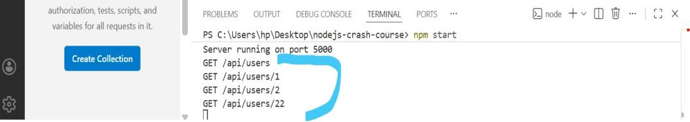  

In Node.js, are basically functions or modules  , that have access to the request object (req) & the response object (res), [becus they sit in the middle of incoming requests & outgoing responses, which they can perform basically any code & you can also make changes to the request & response objects].  
And  the next() function in the application’s request-response cycle. These functions allow developers to execute code , modify request & response objects , and perform various tasks before or after route handlers.   

E.g Diagramatic / pictorial usage & codes on how middleware works (below)   
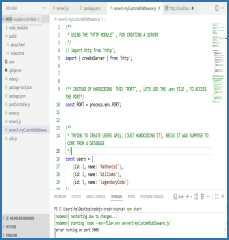  
  
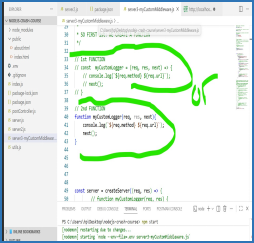  
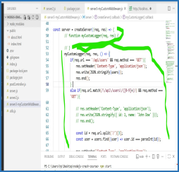  
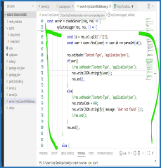  
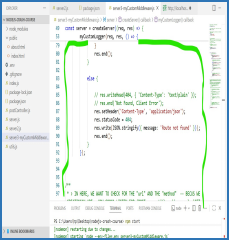  
  
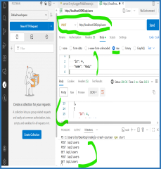  
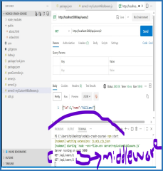  

Server3-myCustomMiddleware File  

/**
 * USING THE "HTTP MODULE" , FOR CREATING A SERVER  
 */  
// import http from 'http';  
import { createServer } from 'http';  

/** INSTEAD OF HARDCODING  THIS "PORT", , LETS USE THE .env FILE , TO ACCESS THE PORT*/  
const PORT = process.env.PORT;  

/**  
 * TRYING TO CREATE USERS APIs, (JUST HARDCODING IT), BECUS IT WAS SUPPOSE TO COME FROM A DATABASE  
 */  
const users = [ 
    {id: 1, name: 'Nathaniel'},
    {id: 2, name: 'Williams'},
    {id: 3, name: 'LegendaryCode'}
];  

/**
 * MY "LOGGER"  CUSTOM MIDDLEWARE    
 *  A middleware that will log the "url" & "the method" when ever a request is made.  
 *   
 * (NOTE: I CREATED IT ON A SEPARATE FILE called (server3-myCustomMiddleware.js),  JUST DOING IT HERE)  
 *    
 * SO FIRST 1st: WE CREATE A FUNCTION  
 */  

// 1st FUNCTION   
// const  myCustomLogger = (req, res, next) => {  
    // console.log(`${req.method} ${req.url}`);  
    // next();  
// }  

// 2nd FUNCTION  
function myCustomLogger(req, res, next){  
    console.log(`${req.method} ${req.url}`);  
    next();  
}  

// JSON  middleware     
// const jsonMiddleware = (req, res, next) => {  
//     res.setHeader('Content-Type', 'application/json');  
//     next();  
// }  
function jsonMiddleware(req, res, next) {  
    res.setHeader('Content-Type', 'application/json');  
    next();  
}  

const server = createServer((req, res) => {  
        // function myCustomLogger(req, res) {  
            
        // }  
        myCustomLogger(req, res, () => {  
            if(req.url === '/api/users' && req.method === 'GET'){  
                res.setHeader('Content-Type', 'application/json');  
                res.write(JSON.stringify(users));  
                res.end();  
            }   
            else if(req.url.match(/\/api\/users\/([0-9]+)/) && req.method === 'GET'){  
                
                // res.setHeader('Content-Type', 'application/json');  
                // res.write(JSON.stringify({ id: 1, name: 'John Doe' }));  
                // res.end();  

                const id = req.url.split('/')[3];
                const user = users.find((user) => user.id === parseInt(id));  

                res.setHeader('Content-Type', 'application/json');  
                if(user){  
                    //res.setHeader('Content-Type', 'application/json');  
                    res.write(JSON.stringify(user));  
                    res.end();  
                }  
                else{  
                    //res.setHeader('Content-Type', 'application/json');
                    res.statusCode = 404;  
                    res.write(JSON.stringify({ message: 'User not found' }));
                    //res.end();
                }  
                res.end();  
            }  

            else {  
                
                // res.writeHead(404, { 'Content-Type': 'text/plain' });  
                // res.end('Not Found, Client Error');  
                res.setHeader('Content-Type', 'application/json');  
                res.statusCode = 404;  
                res.write(JSON.stringify({ message: 'Route not found' }));  
                res.end();  
            }  
        });  
        

/**  
 * > IN HERE, WE WANT TO CHECK FOR THE "url" AND THE "method"  -- BECUS WE CREATINGAN API , YOU GOONA LISTEN FOR 'POST request'(to add a user). 'GET request'(to get the users). 'PUT request' (to update ).  'DELETE request' (to delete).  
 *   
 * > "JSON.stringify()", IS A BUILT-I JAVASCRIPT METHOD USED TO CONVERT A JAVASCRIPT VALUE(typically an object or an array) INTO A JSON(JavaScript Object Notation) STRING. THIS PROCESS IS KNOWN AS SERIALIZATION.  
 */   
    // if(req.url === '/api/users' && req.method === 'GET'){  
    //     res.setHeader('Content-Type', 'application/json');  
    //     res.write(JSON.stringify(users));  
    //     res.end(); 
    // } 
    // else if(req.url.match(/\/api\/users\/([0-9]+)/) && req.method === 'GET'){  
        
    //     // res.setHeader('Content-Type', 'application/json');  
    //     // res.write(JSON.stringify({ id: 1, name: 'John Doe' }));  
    //     // res.end();

    //     const id = req.url.split('/')[3];   
    //     const user = users.find((user) => user.id === pa rseInt(id));  

    //     res.setHeader('Content-Type', 'application/json');  
    //     if(user){  
    //         //res.setHeader('Content-Type', 'application/json');  
    //         res.write(JSON.stringify(user));  
    //         res.end();  
    //     }  
    //     else{  
    //         //res.setHeader('Content-Type', 'application/json');  
    //         res.statusCode = 404;  
    //         res.write(JSON.stringify({ message: 'User not found' }));  
    //         //res.end();  
    //     }  
    //     res.end();  
    // }

    // else {
        
    //     // res.writeHead(404, { 'Content-Type': 'text/plain' });
    //     // res.end('Not Found, Client Error');
    //     res.setHeader('Content-Type', 'application/json');
    //     res.statusCode = 404;  
    //     res.write(JSON.stringify({ message: 'Route not found' }));
    //     res.end();  
    // }  
});

server.listen(PORT, () => {  
    console.log(`Server running on port ${PORT}`);  
});  

**OR (this code below, all works the same thing , but different simplified patterns)**   

/**   
 * USING THE "HTTP MODULE" , FOR CREATING A SERVER  
 */   
// import http from 'http';   
import { createServer } from 'http';   

/** INSTEAD OF HARDCODING  THIS "PORT", , LETS USE THE .env FILE , TO ACCESS THE PORT*/   
const PORT = process.env.PORT;   
/**   
 * TRYING TO CREATE USERS APIs, (JUST HARDCODING IT), BECUS IT WAS SUPPOSE TO COME FROM A DATABASE
 */   
const users = [
    {id: 1, name: 'Nathaniel'},
    {id: 2, name: 'Williams'},
    {id: 3, name: 'LegendaryCode'}
];

/**   
 * MY "LOGGER"  CUSTOM MIDDLEWARE  
 *  A middleware that will log the "url" & "the method" when ever a request is made.
 * 
 * (NOTE: I CREATED IT ON A SEPARATE FILE called (server3-myCustomMiddleware.js),  JUST DOING IT HERE)
 * 
 * SO FIRST 1st: WE CREATE A FUNCTION
 */   

// 1st FUNCTION    
// const  myCustomLogger = (req, res, next) => {   
    // console.log(`${req.method} ${req.url}`);   
    // next();   
// }    

// 2nd FUNCTION -- 1st middleware here   
function myLogger(req, res, next){   
    console.log(`${req.method} ${req.url}`);   
    next();   
}   

/**
 * JSON MIDDLEWARE (A MIDLLEWARE FUNCTION HERE) -2nd MiddleWare here
 */   
// const jsonMiddleware = (req, res, next) => {   
//     res.setHeader('Content-Type', 'application/json');  
//     next();   
// }   
function jsonMiddleware(req, res, next) {   
    res.setHeader('Content-Type', 'application/json');   
    next();   
}   

/**
 * ROUTE HANDLER  FOR "GET" /api/users  (THIS NOT A MIDDLE FUNCTION, IT IS JUST A FUNCTION)
 */   
// const getUsersHandler = (req, res) => {   
//     res.write(JSON.stringify(users));  
//     res.end();   
// }   
function getUsersHandler(req, res) {   
    res.write(JSON.stringify(users));   
    res.end();   
}   

/**
 * ROUTE HANDLER FOR "GET" /api/users/:id   (function)
 */
const getUserByIdHandler = (req, res) => {   
    const id = req.url.split('/')[3];   
    const user = users.find((user) => user.id === parseInt(id));   
    if(user){   
        //res.setHeader('Content-Type', 'application/json');   
        res.write(JSON.stringify(user));   
        res.end();   
    }   
    else{   
        //res.setHeader('Content-Type', 'application/json');   
        res.statusCode = 404;   
        res.write(JSON.stringify({ message: 'User not found' }));   
        //res.end();   
    }   
    res.end();   
}

/**
 * LETS SAY , WE MAKE A "POST" REQUEST, WE CAN ACTUALLY SEND DATA, AND CREATE A NEW USER..
 * SO, LET CREATE A  -  ROUTE HANDLER FOR "POST" REQUEST 
 */   
// ROUTE HANDLER FOR POST /api/users   
const createUserHandler = (req, res) => {   
    let body = '';   
    // LISTEN TO THE DATA
    req.on('data', (chunk) => {   
        body += chunk.toString();   
    });   
    req.on('end', () => {   
        const newUser = JSON.parse(body);  
        users.push(newUser);  
        res.statusCode = 201;  
        res.write(JSON.stringify(newUser));  
        res.end();  
    });

}

/**
 * ROUTE NOT-FOUND HANDLER (function)   
 */
const notFoundHandler = (req, res) => {  
    res.statusCode = 404;  
    res.write(JSON.stringify({ message: 'Route not found' }));  
    res.end();  
} 

const server = createServer((req, res) => {  
        //1st MiddleWare myCustomLogger-  ()next CALLBACK function below  
        myLogger(req, res, () => {  
            
            //2nd Middleware - ()next CALLBACK function   
            jsonMiddleware(req, res, () => {  
                // ROUTING HERE BELOW  
                if(req.url === '/api/users' && req.method === 'GET'){  
                    getUsersHandler(req, res);  
                }
                // FOR ID CHECKING (below)  
                else if(req.url.match(/\/api\/users\/([0-9]+)/) && req.method === 'GET')  
                {  
                    getUserByIdHandler(req, res);  
                }   
                else if(req.url === '/api/users' && req.method === 'POST')  
                {  
                    createUserHandler(req,res);  
                }  
                else   
                {   
                    notFoundHandler(req, res);  
                }   
            });  

});  

server.listen(PORT, () => {  
    console.log(`Server running on port ${PORT}`);  
});  

➡️ **OTHER CORE MODULES:  FS, PATH, URL, EVENTS, PROCESS, OS,  ETC  -  LESSON  6**  

✔️ **File System Modules** :- Some of the File System Modules includes:  
  

✔️ Reading Files With Node.js - (with File System Module) :  There are 3 way to  read a file in Node.js   
We have 3 ways this can be possible :  
1) fs.readFile() : Is one of the simplest way to read a file path, encoding and a callback function that will be called with the file data (and the error).  

E.g  using a callback version  
import fs from 'fs';  

// readFile() -  CALLBACK (Callback Version)  
fs.readFile('./textFsDemo.txt', 'utf8', (err, data) => {  
    // if(err) throw err;  
    // console.log(data);  
    if(err) {  
        console.error(err);  
        return;  
    }else{  
        console.log(data);  
    }  
    
});  

2) fs.readFileSync() : For simple scripts, you can use  synchronous methods , but  avoid them in  "production servers" as they can block the event loop.  
E.g  using a Synchronous version  
/**  
 * READINg FILES  "SYNCHRONOUSLY" 
 * FOR simple scripts, you can use  synchronous methods , but  avoid them in  "production servers" as they can block the event loop.  
 */  

import fs from 'fs';  
// const data = fs.readFileSync('./textFsDemo.txt', 'utf8');  
// console.log(data);   
try {  
    const data = fs.readFileSync('./textFsDemo.txt', 'utf8');  
    console.log(data);  
} catch (err) {  
    console.error(err);  
}  

3) fsPromises.readFile() : Is the more modern approach to read files.   
	E.g  using a Promises version   

/**   
 * READINg FILES  WITH "PROMISES" (MODERN APPROACH)   
 */   

//ASYCHRONOUS NAMED FUNCTION   
// async function readFile() {   
//     try {   
//         const data =  await fs.readFile('./textFsDemo.txt', 'utf8');   
//          console.log(`File Content ${data}`);   
//         // console.log('File content:', data);   
//     }    
//     catch (err) {   
//          console.log(`Error Reading File: ${err}`);   
//         // console.log('Error reading file:', err);   
//     }   
// }   
// readFile();   

// ASYNCHRONOUS ARROW FUNCTION   
const readFile = async () => {   
    try {   
        const data =  await fs.readFile('./textFsDemo.txt', 'utf8');  
         console.log(`File Content ${data}`);   
        // console.log('File content:', data);  
    }    
    catch (err) {   
         console.log(`Error Reading File: ${err}`);   
        // console.log('Error reading file:', err);   
    }   
};   
 
readFile();   

✔️ Some Common UseCases Of  “File System Module” Include:  

✔️ File Operations:  
a) Read & write files.  
b) Create & delete files.  
c) Append files   
d) Rename & move files.Change file permissions.  

✔️ Directory Operations:  
a) Create & remove directories.  
b) List directory contents.  
c) Watch for file changes.  
d) Get file/directory stats.  
e) Check file existence.  

✔️ Advanced Features:
a) File streams.  
b) File descriptors.  
c) Symbolic links.  
d) File watching.  
e) Working with file  permisions.  

✔️ Writing Files With Node.js Using  - (with File System Module) : There are also  3 way to  “Write file” in Node.js :  
	
We have 3 ways this can be possible :  
1.fs.writeFile() : This is the callback version of wrtiting  file.  
E.g  using a callback version (to writeFile)  

import fs from 'fs';  
// writeFile() -  CALLBACK (Callback Version)  
const myContent = 'Iam writing my name Williams, to this file location';  
fs.writeFile('./textFsDemo.txt', myContent, (err, data) => {  
    if(err){  
        console.error(`Error Writing The File: ${err}`);  
        return;  
    }    
    else{  
        console.log(`File successfully written: ${myContent}`);  
    }  
})  

2.fs.writeFileSync() : This is the Synchronous version of wrtiting file.  
E.g  using a Synchronous Version (to writeFile)  

// writeFile() -  SYNCHROUNOUS (synchronous Version)  
// const myContent = 'Iam writing my name Williams, to this file location';  
//const myContent = 'This is a file am writing to with my name LegendaryCode, written';  
import fs from 'fs';  
  

try {
    const data = fs.writeFileSync('./text-fsDemo.txt', 'My file am writting to');  
    console.log(`File Written succesful ${data}`);  
} catch (err) {  
    console.error(`Error Writing This Syncronous File: ${err}`);
    
}  

3.fs.Promises.writeFile() : This is the Promises based version of wrtiting file.  
E.g  using a Promises version (to writeFile)  
// ASYNCHRONOUS ARROW FUNCTION   
const writeFiles = async () => {  
    try {
        // const myContent = 'This is just my content for wrting into the text file';  

        await fs.writeFile('./text-fsDemo.txt', 'Hi, iam writing to this file');  
        //  console.log(`File Content ${data}`);  
        // console.log('File content:', data);  
        console.log('file wrtitten to: ');  
    }   
    catch (err) {  
         console.log(`Error Reading File: ${err}`);  
        // console.log('Error reading file:', err);  
    }  
};  

writeFiles();  

✔️ **Path Modules :-** 
Getting information out of a path. Given a path, you can extract information out of  it using  these methods below:  
a)dirname:  gets the parent folder of a file.  E.g   
b)basename: gets the filename path. E.g   pathDemo.txt  
c)extname:  gets the file extension.  E.g  .txt  
	
Eg using the dirname, basename, extname:  
import path from 'path';  

const notesPath = './user/legendarycode/pathDemo.txt';  

const dir = path.dirname(notesPath);  
//RESULT - dirname: ./user/legendarycode  
console.log(`dirname: ${dir}`);  

const base = path.basename(notesPath);  
//RESULT - basename: pathDemo.txt  
console.log(`basename: ${base}`);  

const ext = path.extname(notesPath);  
//RESULT - extname:  .txt  
console.log(`extname: ${ext}`);  

✔️  You can  join two (2) or more parts of a path by (using path.join()) :  
Eg using path.join:  

/**
 * WORKING WITH "path" MODULE  
 * You can join 2 or more part together using "path.join()"  
 */
const myName = 'Nathaniel';  
const joinResult = path.join('/',  'user', myName, 'welcome.txt');  
console.log(`Join : ${joinResult}`);

✔️ How You Can Get The “filename” , “dirname” Of The Current File Using  The “url” &  “path” IMPORT MODULE (Using path& url  module) :  
		Eg using path.join:  
 * HOW TO GET THE "filename", "dirname" OF THE CURRENT FILE, Using the "url" & "path" import module   
 */  
import url from 'url';  
import path from 'path';  

const  __filename = url.fileURLToPath(import.meta.url);  
const __dirname = path.dirname(__filename);  

console.log(`The Filename & Dirname :  ${__filename} & ${__dirname}`);  
// RESULT; The Filename & Dirname :  C:\Users\hp\Desktop\nodejs-crash-course\pathDemo.js & C:\Users\hp\Desktop\nodejs-crash-course  

✔️ **OS  Modules :-**  The “OS” module in Node.js provides a powerful set of utilities for interacting with the underlying operating system. It gives you informations  about your Pc(system), cpu etc..  
It offers a cross-platform way to access system-related information & perform common operating system tasks.   
Eg 1:  using os module:  
import os from 'os';  

const osUsage1 = os.platform();  
const osUsage2 = os.version();  
console.log(`Platform: ${osUsage1} , Version: ${osUsage2}`);  
// RESULT: Platform: win32 , Version: Windows 11 Pro  

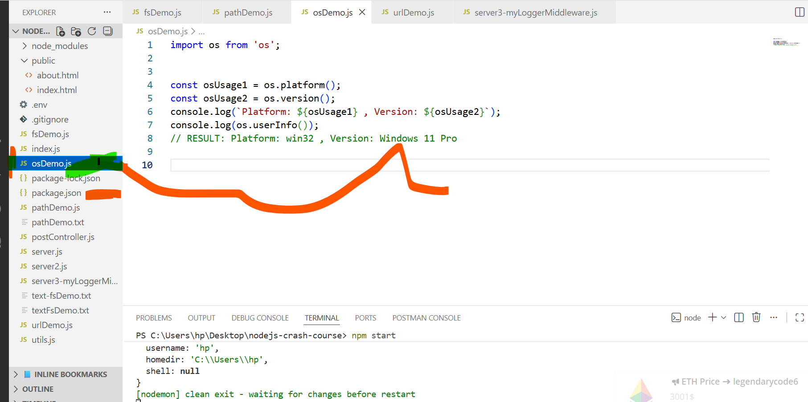  

✔️ **URL Modules :** The “url” modules provides utilities for URL  resolution and parsing.  
It can be used to split up  a web address  into readable parts, contruct URLs and handle  different URL component.  
Eg 1:  using url module:  
import url from 'url';  

//URL STRING  
const myURL = 'https://www.google.com/search?q=LegendaryCode';  

//URL OBJECT  
const urlObject = new URL(myURL);  

// URL Methods usage  
console.log(urlObject);  
console.log(`pathname ${urlObject.pathname}`);  
console.log(`Hostname ${urlObject.hostname}`);  
console.log(`Hash ${urlObject.hash}`);  
console.log(`Password ${urlObject.password}`);  
console.log(`Format: ${url.format(urlObject)}`);  

console.log(params);
console.log(params.get('q'));
// RESULT 1:  URLSearchParams { 'q' => 'LegendaryCode' }
// RESULT 2: LegendaryCode  

NOTE: In Node.js , import.meta is a special meta-property available within ECMAScript Modules(ES Module).
It’s provides an object containing metadata  about the current module  
Eg :  using using the import.meta property:  
import url from 'url';  

//Geting "Current File" Url  
console.log(`Current File: ${import.meta.url}`);  
// RESULT:  Current File: file:///C:/Users/hp/Desktop/nodejs-crash-course/urlDemo.js  

//Getting the "fillURLToPath()" Url  
console.log(`Current Path: ${url.fileURLToPath(import.meta.url)}`);  
// RESULT:  Current Path: Current Path: C:\Users\hp\Desktop\nodejs-crash-course\urlDemo.js  
// const  __filename = url.fileURLToPath(import.meta.url);  

✔️ **Crypto Modules:** The “crypto” modules is a built-in module, that provides cryptographic functionality including:  

1. Hash function (SHA - 256, SHA-512, etc.)  
2. HMAC (Hash-based Message Authentication Code).  
3. Symmetric encryption (AES, DES, etc).  
4. Asymmetric encryption (RSA, ECDSA, etc ).  
5. Digital Signatures and verifications.  

The Crypto module is essential for applications that need  to handle sensitive information securely.  
“The module” is often used to handle sensitive data , such as:  
User authentication and password storage.   
Secure data transmission.  
File encryption and decryption.  
Secure communication channels.  

Eg 1:  using crypto module:  

import crypto from 'crypto';  
//CREATING A "HASH"  
const myDataHash = 'Hello, This is LegendaryCode Password';
const hash = crypto.createHash('sha256');
const myHash = hash.update(myDataHash);
const myDigest = myHash.digest('hex');
console.log(`Cryptographic Result: ${myDigest}`);  

// RESULT:  Cryptographic Result: e7c15c5c9e515a63a005f4d83cf7071e74606aff6435175f5759fdf5f6f8eec1  

Eg 2:  using crypto module:  
//randomBytes  
crypto.randomBytes(256 , (err, buf) => {  
    if(err) throw err;  
    console.log(`${buf.length} Bytes of random data: ${buf.toString('hex')}`);  
});  
// RESULT:  256 Bytes of random data:   9a528e209d8ecc1bc8093c3a9047b695c0a5c99ee847bdceb109c629f84cbdc512927159708625e16ecc7cebe0afe200e471d1022b11596f338d71f72eb16fade9226505de08797ae185d932c20f163324b94db769e032bd5c015377363227da106550b16fd93bf844afec88da31215b661e52442ffd582ef214f7ac8d59e86970153f24cf1d386d2d8e805a614c7128b5c50a2c6aa1411122973bd595586de2b573fa36eb8de544cfb4a4af25654beba8ea4c70f23f99e1aac97d7c0979238207723c05263d5ad46ab4f218a24a198572b1dd4e5f2b2fd61b6327838defa745629a56db93ece543d2ec4ba2bfe8db7b30f3a18f6b2e9859192f1ef16559aeb5

Eg 3:  using crypto module:  
/**  
 *  HOW TO "encrypt" AND "decrypt" DATA ..  
 * createCipheriv(encrypt) & createDecipheiv (decrypt)  
 */  
import crypto from 'crypto';  

//createCipheriv(encrypt) & createDecipheiv (decrypt)  
//Algorithm   
const algorithm = 'aes-256-cbc';  
//The key  
const key = crypto.randomBytes(32);  
//The iv  
const iv  =  crypto.randomBytes(16);  

//TO ENCRYPT(OR GET OUR "cipher" text)  
const cipher = crypto.createCipheriv(algorithm, key, iv);  
let encrypted = cipher.update('Hi, legendaryCode, THis is a secret message', 'utf8', 'hex');  
encrypted += cipher.final('hex');  
console.log(`ENCRYPTED VALUE: ${encrypted}`);  
// RESULT: ENCRYPTED VALUE: 8adfb2777543d796282dc66687c75eab426b568670d182338a759eb4d547b7467da5f09385f6583dff7c69d9ece07718  

Eg 4:  using crypto module:  
import crypto from 'crypto';  
//TO DECRYPT()  
const decipher = crypto.createDecipheriv(algorithm, key, iv);
let decrypted = decipher.update(encrypted,  'hex' , 'utf8');
decrypted += decipher.final('utf8');  
console.log(`DECRYPTED VALUE: ${decrypted}`);  
// RESULT: ENCRYPTED VALUE:  DECRYPTED VALUE: Hi, legendaryCode, THis is a secret message  

✔️ **Events  Module :** The “Event” module is a great for building real-time application (E.g becusyou can create custom events, & you can listen to the events).

Eg :  using Event module:
import EventEmitter from 'events';

//CREATING AN INSTANCE OF EventEmitter
const emitter = new EventEmitter();

//CREATING SOME HANDLERS (2 functions)
function welcomeHandler(success) {
    console.log(`Hi, legendarycode, good to have you... ${success}`);
}
function relentlessHandler(){
    console.log('I will win, because am relentless');
}

/**
 * REGISTRING AN Event Listener
 */
// emitter.on('Rich Till I Die', () => {
//     console.log('Definitely');
// });
emitter.on('WhatsUp', welcomeHandler);
emitter.on('Victory', relentlessHandler);

/** EMIT  AN EVENT */
emitter.emit('WhatsUp', 'Just BELIEVE');   
emitter.emit('Victory');   

✔️  **Process Module:** The “process” module  provides information about and control over the current  Node.js process, is a built module and can be imported and used directly with an ES module environment.   
		
Eg :  using Process module:   
import process from 'process';   

console.log(`Platform:  ${process.platform}`);   
// RESULT:  Platform:  win32     

const archValue = process.arch;  
if(archValue.length < 3 ){   
    console.log(`The Argv Value Is: ${archValue}`);  
}  
else {  
    console.log(`Not passed, No argument`);  
}
// RESULT: Not passed, No argument  
// RESULT:  The Argv Value Is: C:\Program Files\nodejs\node.exe,C:\Users\hp\Desktop\nodejs-crash-course\processDemo.js  

//process.env  
console.log(process.env);   

